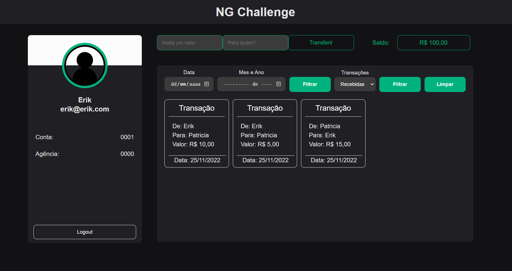

<h1 align="center"> 📦 Change Cash 📦 </h1>

<div align="center">



</div>

## 📓 Descrição

  Este projeto foi feito com base no desafio pratico fornecido por uma empresa na qual participei do processo de celação, para que seja desenvolvida uma solução bancaria simple.

<details>
  <summary>Sobre o desenvolvimento</summary>
  <br />

  Para o desenvolvimento do projeto, utilizei as informações disponibilizadas pela empresa para a construção da API, Banco de Dados e Front-end.
  Para a construção do banco de dados utilizei o banco [PostgreSQL](https://www.postgresql.org/) junto a ORM [Prisma](https://www.prisma.io/), para a API utilizei o [NodeJS](https://nodejs.org/en/) e para o Front-end utilizei o [ReactJS](https://reactjs.org/) junto ao [Typescript](https://www.typescriptlang.org/).

  Inicialmente fiz a modelagem do banco a partir dos schemas do prisma, em fiz a dockerização do banco de dados para que pudesse fazer a conexão entre ele e a API. E apos isso fiz o mesmo com o restante da aplicação para que possa ser facilmente executada por completo em qualquer ambiente.

  Minha maior dificuldade nesse processo foi a própria dockerização do projeto por completo, pois nunca havia feito isso antes, sempre partes avulsas, mas com a ajuda de alguns amigos em algumas duvidas pontuais e pesquisas na internet consegui contornar e resolver o problema.

  <br />
</details>
  <br />

### Habilidades e Tecnologias 💻

<details>
  <summary> 🦾 Habilidades 🦾</summary>
  <br />

* Desenvolvimento de aplicações React
* Desenvolvimento de APIs REST
* Consumo de APIs REST
* Desenvolvimento de banco de dados(SQL, Postgres)
* Criatividade
* Solução de problemas

  <br />
</details>

<details>
  <summary> 🖥️ Tecnologias utilizadas 🖥️</summary>
  <br />

* React
  * React Hooks
  * React Router
* React Query
* HTML5
* CSS3
* Styled-Components
* Material-UI
* TypeScript
* Axios
* PostgreSQL
* Node.js
* Express
* Prisma
* JWT
* Bcrypt
* Md5
* ESLint
* Prettier
* EditorConfig
* Docker/ Docker Compose
* Git/ GitHub
* Insomnia
* Shell Script

  <br />
</details>

  <br />

### 📚 Documentação 📚

  <details>
    <summary> 🚀 Rodando o projeto sem Docker</summary>
    <br />

* Dentro da pasta do projeto, execute o comando abaixo para instalar as dependências do projeto:

    Caso utilize o npm:

    ```sh
      npm run install:all
    ```

    Caso utilize o yarn:

    ```sh
      yarn run install:all
    ```

  * Para instalar as dependências necessárias para o funcionamento do front e back-end


* Ainda dentro da rais do projeto, execute os comando abaixo para iniciar o container do docker:

    ```sh
      npm run docker:local
    ```
    ou
    ```sh
      yarn run docker:local
    ```
  * Para iniciar o container do docker(Essa operação pode levar alguns minutos)
  * Apenas o container do banco de dados sera iniciado

* Após a inicialização do container do banco de dados, execute o comando abaixo para executar as migrations do banco de dados:

    ```sh
      npm run prisma:migrate
    ```
    ou
    ```sh
      yarn run prisma:migrate
    ```

* Para executar a aplicação va até a pasta do front-end e execute os comando abaixo:

    ```sh
      cd app/frontend
    ```

    * Para entrar na pasta do front-end e depois execute:


    ```sh
      npm run dev
    ```
    ou
    ```sh
      yarn run dev
    ```

  * E o mesmo para iniciar o back-end da aplicação, porem abra uma nova aba no terminal e execute os comando abaixo:

    ```sh
      cd app/backend
    ```

    ```sh
      npm run dev
    ```
    ou
    ```sh
      yarn run dev
    ```

* Após o uso para excluir o container do docker, execute o comando abaixo:

    ```sh
      npm run docker:rm:local
    ```
    ou
    ```sh
      yarn run docker:rm:local
    ```

  </details>
<br />

  <details>
    <summary> 🚀 Rodando o projeto dentro do Docker</summary>
    <br />

* Dentro da pasta do projeto, execute o comando abaixo para instalar as dependências do projeto:

    ```sh
      npm run prisma:migrate
    ```

    * Este comando iara executar as migrations do banco de dados e assim criar as tabelas necessárias para o funcionamento da aplicação.

    * Ainda dentro da pasta do projeto, execute o comando abaixo para executar a orquestração dos containers do docker:

    Caso utilize o npm:

    ```sh
      npm run compose:up
    ```

    Caso utilize o yarn:

    ```sh
      yarn run compose:up
    ```

  * Para subir o container do docker e instalar as dependências necessárias para o funcionamento do front e back-end, essa operação pode levar alguns minutos.

* Para excluir o container do docker, execute o comando abaixo:

    ```sh
      npm run docker:rm
    ```
    ou
    ```sh
      yarn run docker:rm
    ```


  </details>
<br />

### 🤝 Colaborador 💻

<br />
<table>
  <tr>
      <td align="center">
      <a href="https://github.com/erik-efl">
        <br>
        <sub>
          <b>Erik Lima</b>
        </sub>
      </a>
    </td>
  </tr>
</table>

<br />

##

### 🚩 Implementações por vir 🚩

<details>
  <summary> 📌 Alterações futuras 📌</summary>
  <br />

* Implementação de testes unitários
* Implementação de testes de integração
* Implementação de testes de aceitação
* Implementação de testes E2E
* implementação de nova UI kit
* Implementação de novas funcionalidades
  * Implementação de um sistema de notificações
  * Implementação de um sistema de comentários
  * Implementação de um sistema de compartilhamento
  * Implementação de um sistema de favoritos
  * Implementação de um sistema de tags
  * Implementação de um sistema de categorias
  * Implementação de um sistema de pagamentos
  * Implementação de um sistema de avaliações
  * Implementação de um sistema de relatórios
    * Implementação de um sistema de relatórios de usuários
    * Implementação de um sistema de relatórios de gastos
    * Implementação de um sistema de relatórios de receitas
    * Implementação de um sistema de relatórios de pagamentos
    * Implementação de um sistema de impressão de gastos totais
    * Implementação de um sistema de impressão de receitas totais
  * Implementação de um sistema de denúncias
* Implementação de um sistema de autenticação com o Smart Token
* Implementação de um sistema de autenticação com o Authentication Code
* Implementação de um sistema de autenticação com o CPF


  <br />
</details>

<br />
<br />

## ⚙️ Status do Projeto 🛠️

  ```js
    let projeto {
      "status": "Em desenvolvimento"
    }
  ```
##

### ©️ Aviso de direitos autorais

Desenvolvi este projeto para propósitos de aprendizagem, todo o código e documentação são de minha autoria e os direitos me pertencem exclusivamente. É permitido baixar ou clonar o repositório para fins de estudo. Contudo, não é permitido publicar cópias totais ou parciais. Este aviso não cobre bibliotecas e dependências, estas estão sujeitas a suas respectivas licenças.
